# System of Equations 3x3

Congratulations. You should be very proud of yourself. You have learned complicated linear algebra concepts such as systems of linear equations, matrices, and determinants. You've seen them in 2 by 2 matrix. The general concepts are very similar, but in order to really nail them down, follow me along to see them defined in 3 by 3 matrices

## Quiz: System of Equations

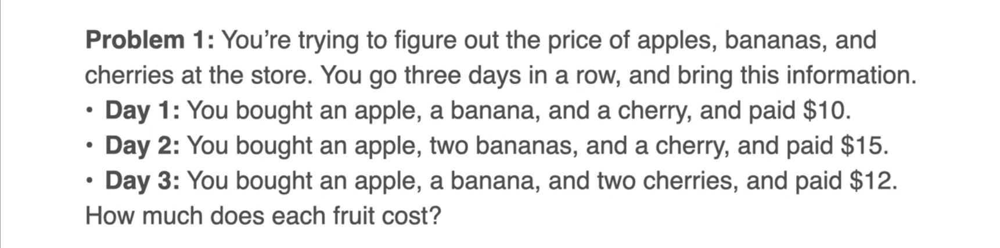
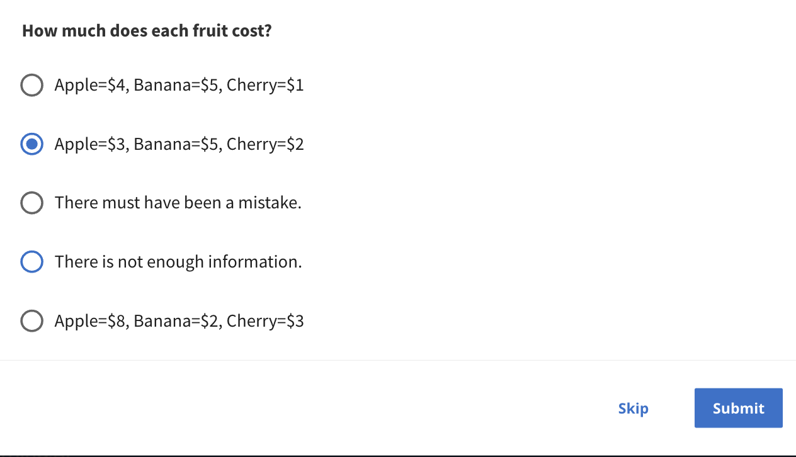

To start, you'll be solving first system of three equations with three unknowns and the problem is a familiar one. You are in a similar stores before, but now your goal is to find the prices of three items, an apple a banana and a cherry. You go to the store three days in a row. On the first day you bought an apple or banana and a cherry and pay 10 dollars. On the second day you bought an apple, 2 bananas and a cheery and paid 15 dollars and on the third day about an apple and banana and 2 cherries and paid 12 dollars. Now the question is, how much does each fruit cost?

## Solution: System of Equations

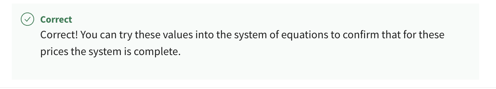

The way to solve this is very similar to the way to solve the previous systems with two equations and two unknowns. The first equation says that an apple, a banana and a cherry cost 10 dollars. The second one says that the same arrangement plus an extra banana cost 15 dollars. Therefore, that extra banana must cost those extra 5 dollars and the third one says of the same arrangement of Day 1 plus an extra cherry cost 12 dollars, therefore, that extra cherry must cost that extra 2 dollars so bananas 5 and cherry is 2. We still need to find the price of the apple. 

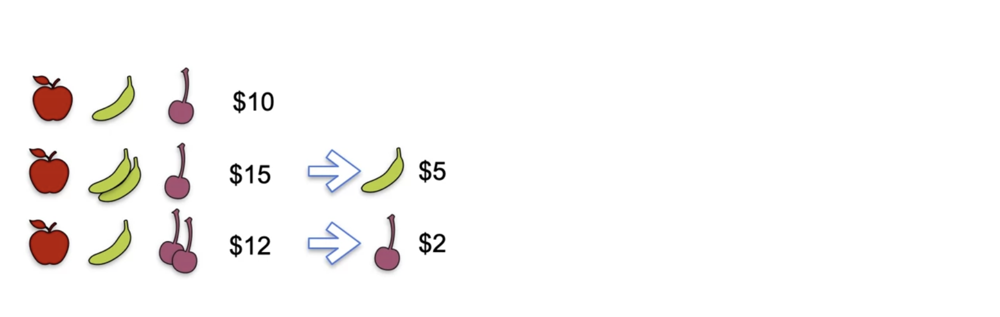

Now look at the first equation, if the banana is 5 and the cherry is 2 and the three of them costs 10 dollars then the apple must cost 3 dollars. 

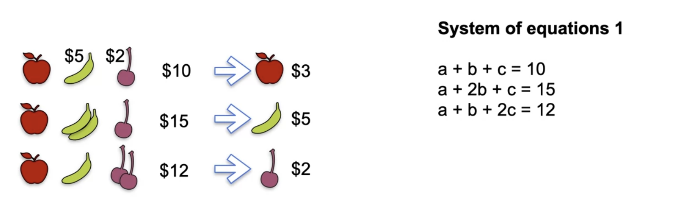

Our solutions are the price an apple is 3 dollars, the price of banana is 5, and the price for cherry is 2. The system of equations you just solved is this one over here, system of Equations 1, which has it's equations a plus b plus c equals 10, a plus 2b plus c equals 15 and a plus b plus 2c equals 12 and the solution you got was a equals 3, b equals 5, and c equals 2.

## Quiz: System of 3 Equations

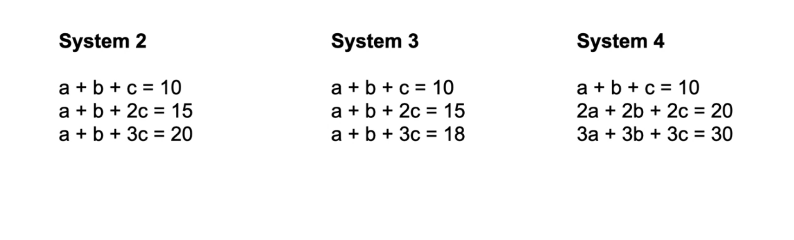
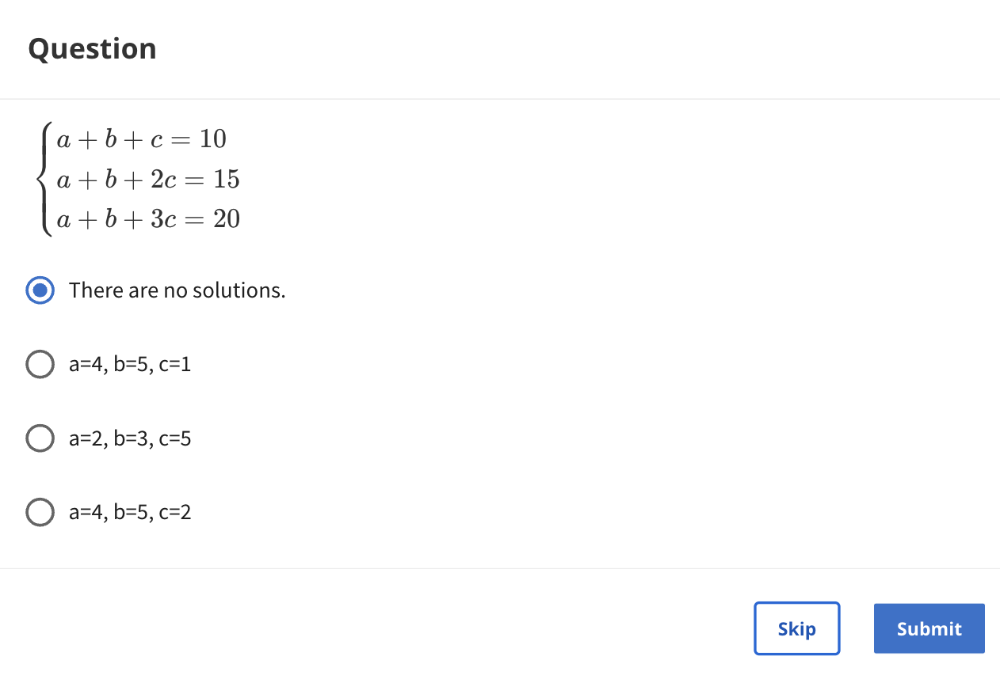

Now you're ready to solve more systems. Here are three systems to solve. Remember that just like before, some of them may not have a solution. Some of them may have an infinite number of solutions. 
 
 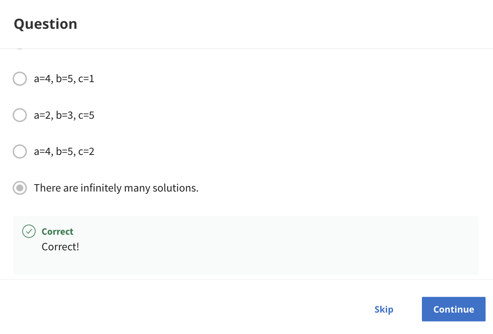
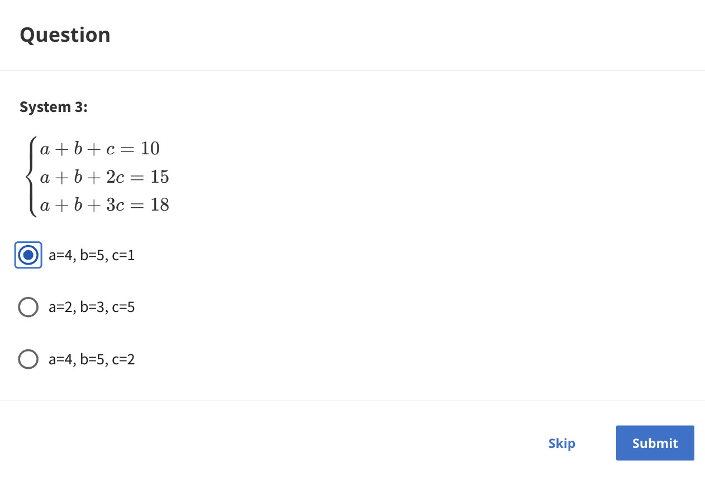

If that's case, please stated, even if any of the options all ready shows a solution to the system. Here, the solution, System 2 has infinitely many solutions. Why? Well, you look at equation 1, it says a plus b plus c equals 10 and for Equation 2, there's an extra c and an extra 5, so that's c equals 5, the price for cherry is 5. 

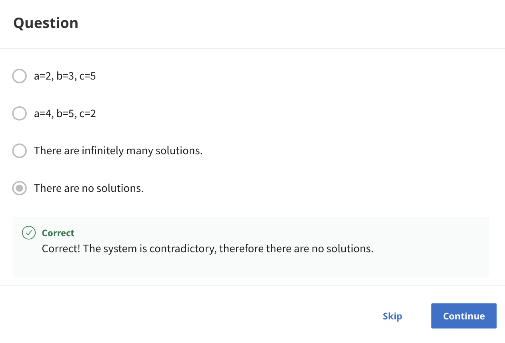
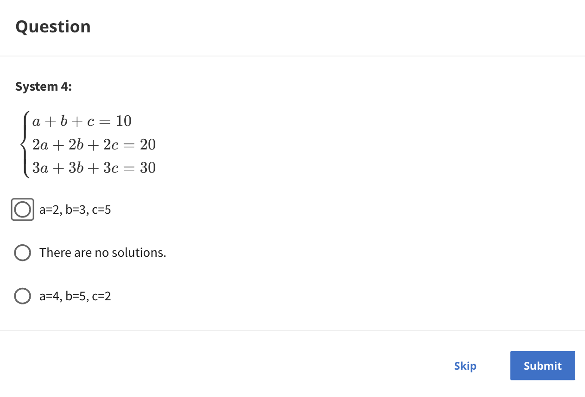
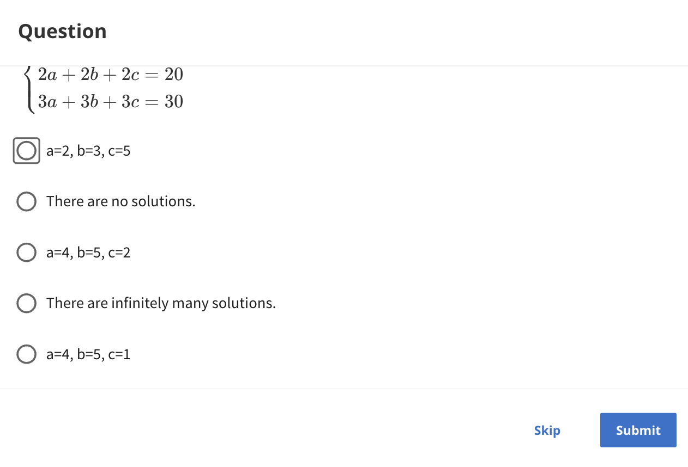
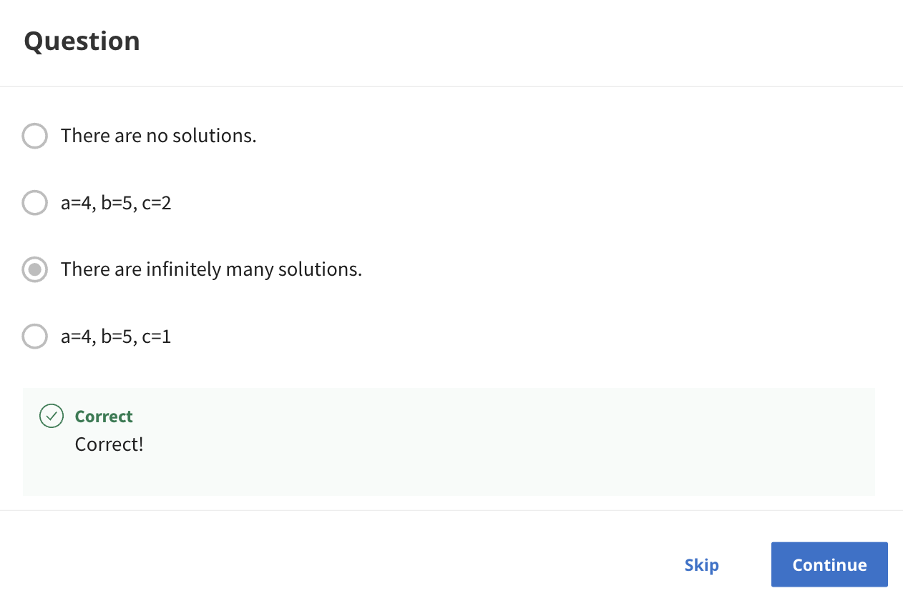
 
However, when you go from Equation 2 to 3, there's also an extra 5 and also an extra c so Equation 3 brings nothing new to the table. When you replace c equals 5 on the first equation, you get a plus b equals 5 and actually any triplet where the third number is 5 and the first 2 add to 5 works.

## Solution: More Systems of Equations

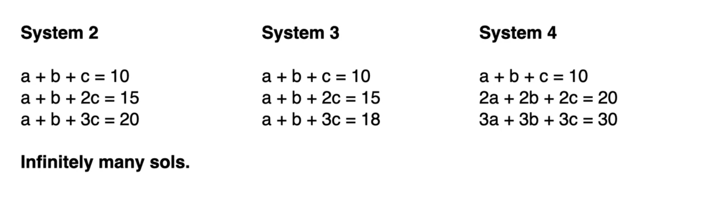

System 2 has infinitely many solutions. 

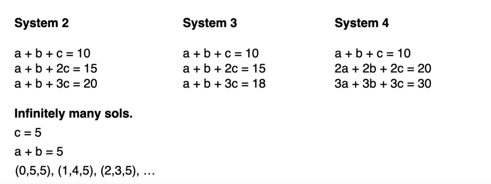

Why? Well, you look at equation 1, it says a plus b plus c equals 10 and for Equation 2, there's an extra c and an extra 5, so that's c equals 5, the price for cherry is 5. However, when you go from Equation 2 to 3, there's also an extra 5 and also an extra c so Equation 3 brings nothing new to the table. When you replace c equals 5 on the first equation, you get a plus b equals 5 and actually any triplet where the third number is 5 and the first 2 add to 5 works. All of these are solutions to that system, that has infinitely many solutions. 

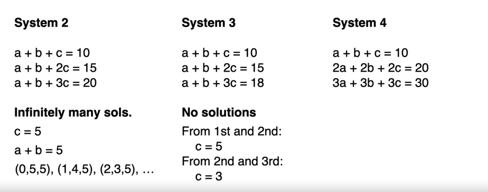

Now let's look at System 3. System 3 has no solutions, why? Well, from the first and the second equation, c equals 5. However, from the second and the third, c equals 3 because from the second equation to the third one, you bought an extra cherry and you paid an extra 3 dollars, so c equals 5, but c equals 3, that's a contradiction so System 3 has no solution. 

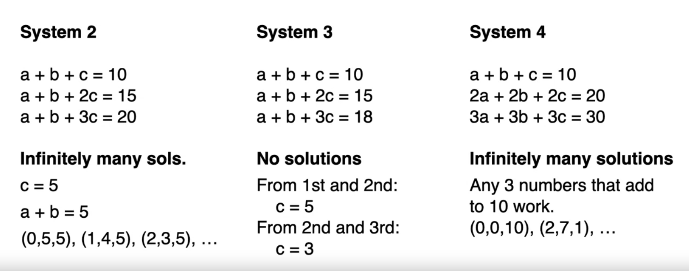

What about System 4? 
Well, System 4 has infinitely many solutions, why? Because as you can see, the second equation is 2 times the first one and the third equation is 3 times the first one. The first one is really the only equation here that matters or equivalently the second or the third, but only one of them matters. Any three numbers that add to 10 would work, for example 0, 0, 10 2, 7, 1, 9, 1, 0, any three numbers that add to 10 are solution, so we have infinitely many solutions.