# Linear dependence and independence (3x3)

When you learned two-by-two matrices, there was a very important concept called linear dependence and independence, which determined if a matrix was singular or non-singular. 

In short, at two-by-two matrice has linearly dependent rows, if one row is a multiple of the other one. 

For larger matrix, the concept of linear independence and dependence is a bit more complex, but still very intuitive. 

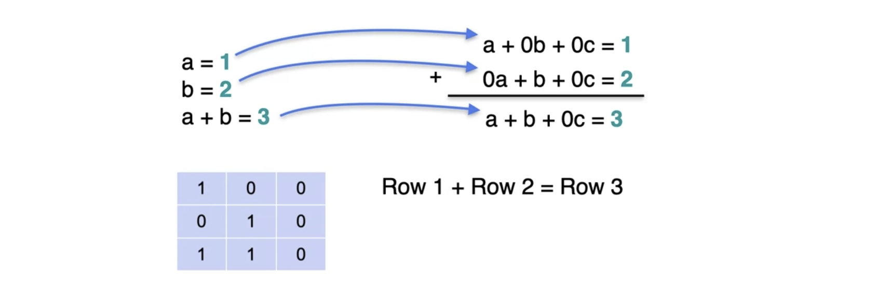

Follow along for the details. In order to understand linear dependence, consider the following example. Take a look at the system with three equations and three unknowns. The equations are a equals 1, b equals 2, and a plus b equals 3. Now, notice that c doesn't appear, but that doesn't matter. Now this system is singular for the simple reason that the third equation is the sum of the first two. To see this more in detail, the first equation can be written as a plus 0b plus 0c, equals one. 

The second one is 0a plus b plus 0c equals 2. If we add them, we get a plus b plus 0c equals 3, which is precisely the third equation. Now consider the matrix of the coefficients of the system. That's the matrix obtained by forgetting the constants. The matrix has entries 100, 010 and 110. In the same way that the sum of the first two equations is the third one. The sum of the first two rows in the matrix is equal to the third, because 1 plus 0 is 1, 0 plus 1 is 1 and 0 plus 0 is 0. Therefore, row 3 depends on rows one and two.

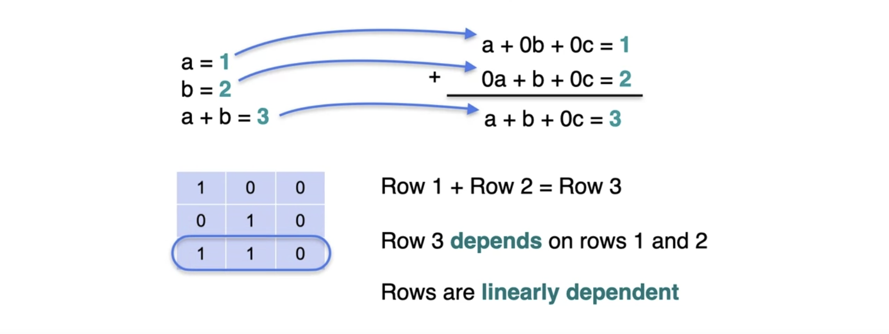

Row 3 in the same way as equation three doesn't bring anything new to the table is the sum of the first two. We say that the rows are linearly dependent, because from the first and the second, you can form the third one. Therefore, this matrix and the system are singular. 

Now let's look at another system which you've already seen that it's singular.
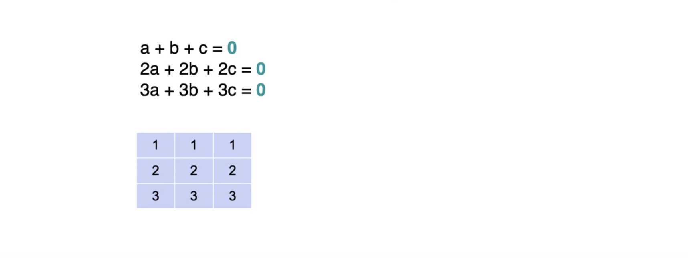

The corresponding matrix is this one over here, 111, 222, 333. Notice that there are many relations between the equations of the system. Here's one. The first equation plus the second equation equals the third equation. In the matrix, Row 1 plus Row 2 is equal to Row 3. 

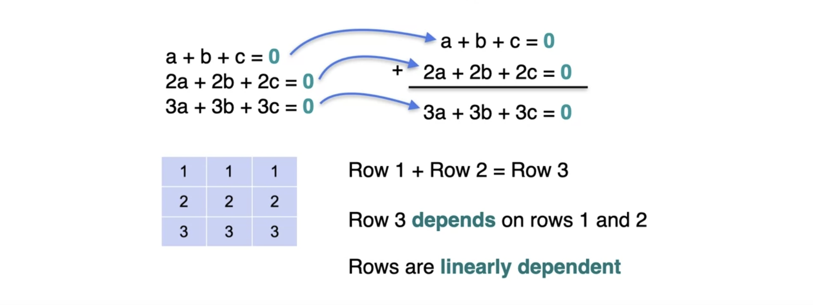

Row 3 depends on Rows 1 and 2, meaning that the rows are linearly dependent. Now if you look closely, this system and this matrix have a lot of our dependencies. For example the second row is twice the first row and the third row is three times the first row. This is a highly singular system with a lot of dependencies between the rows. Now in order to really understand the concept of linear dependence and independence, 

Let's take a look at this other system, which you've also seen is singular.

Now this one is a little more subtle. What are the relation between the equations? Well, here's one. Let's take the first equation and let's add it to the third equation. 

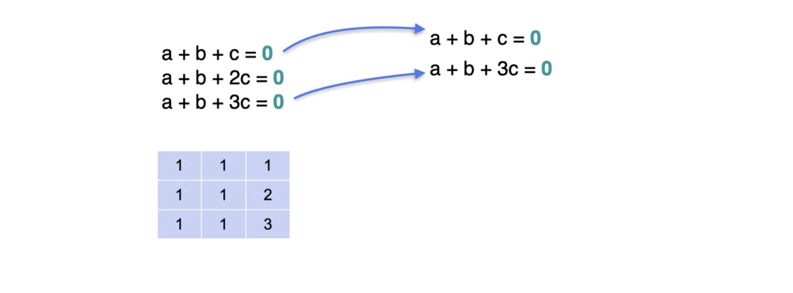

What do you get? You get 2a plus 2b plus 4c is equal to 0. 

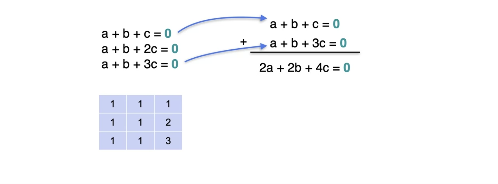

Now that doesn't look like one of the equations perhaps, or perhaps, yes, if you take this equation and divide it by 2, you get a plus b plus 2c equals 0, which is precisely the second equation. In other words, the second equation is the average of the first and third equation. 

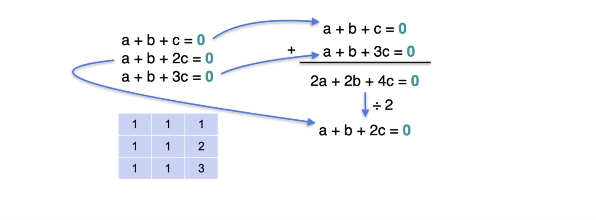
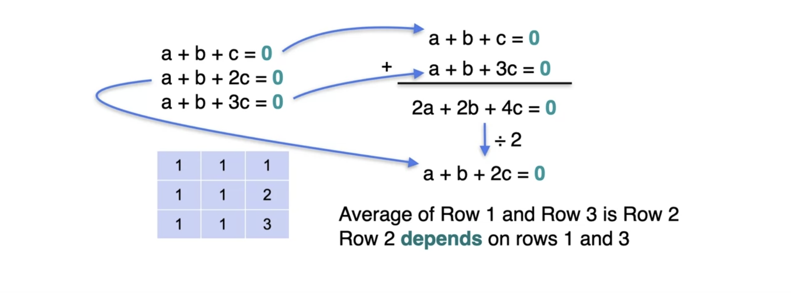

In the same way, the average between Row 1 and Row 3 of the matrix is Row 2, so Row 2 depends, Rows 1 and 3. 

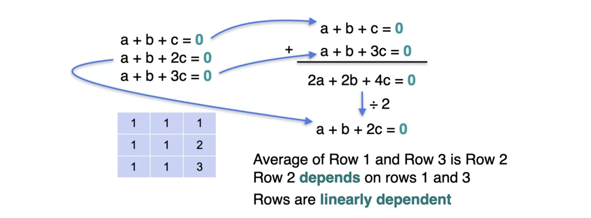

Therefore the rows of this matrix, as well as the equations in the system are linearly dependent.

Now in contrast, take a look at this system of equations you've seen before that this system has a unique solution, so it's non-singular.
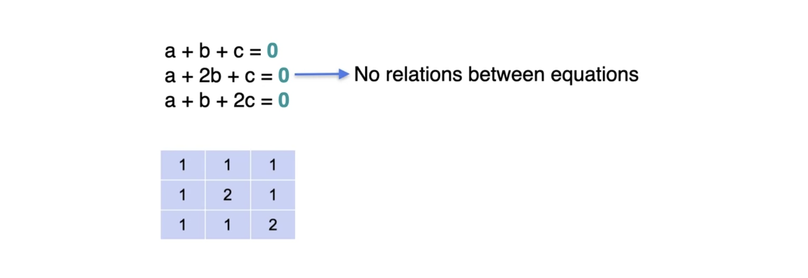

Now, no matter how much you try, it is impossible to find any linear relations between these equations. There's no way you can obtain the third one, are the other two, or the second one or the first and the third. There's nothing you can do here. 

The same thing happens in the matrix. No row can be obtained as a linear combination of the other two rows. Thus the rows are linearly independent. This implies that the matrix is non-singular. 

Now as you can see, it's not easy to see and to verify that there's no relations. Don't worry soon I'm going to show you some methods to be able to verify this. 

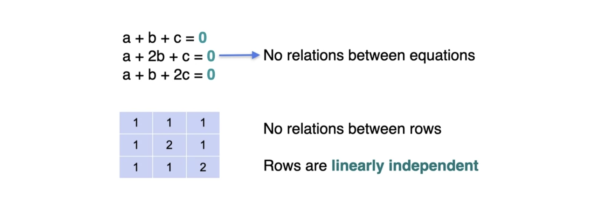

But for now you're ready for a quiz

## Quiz: Linear dependence and independence
Determining the following matrices have linearly dependent or independent rows, and the answers are in for the first matrix

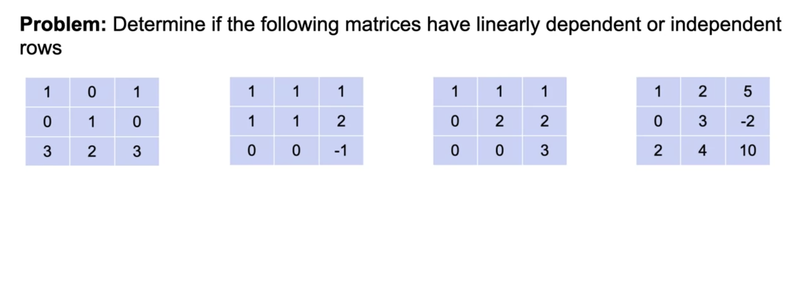

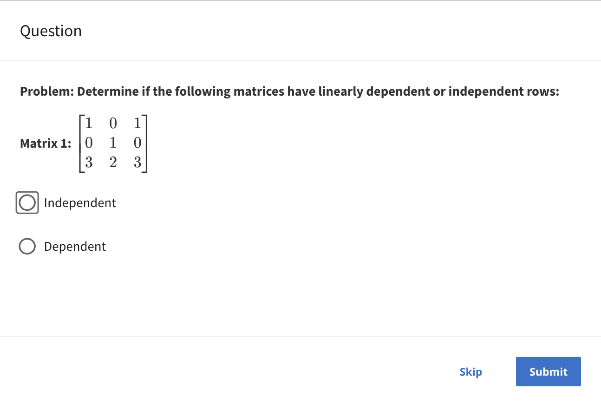

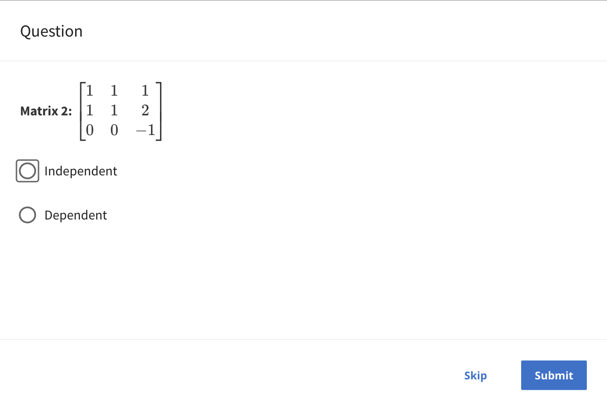

## Answers: Linear dependence and independence

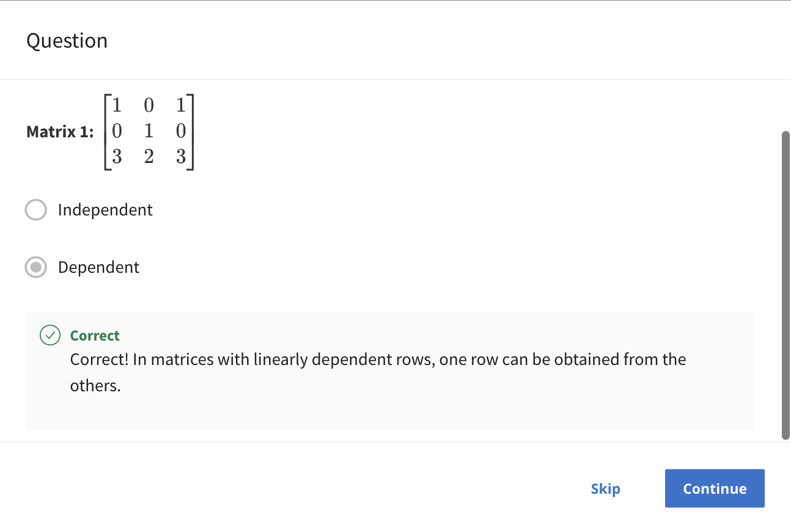

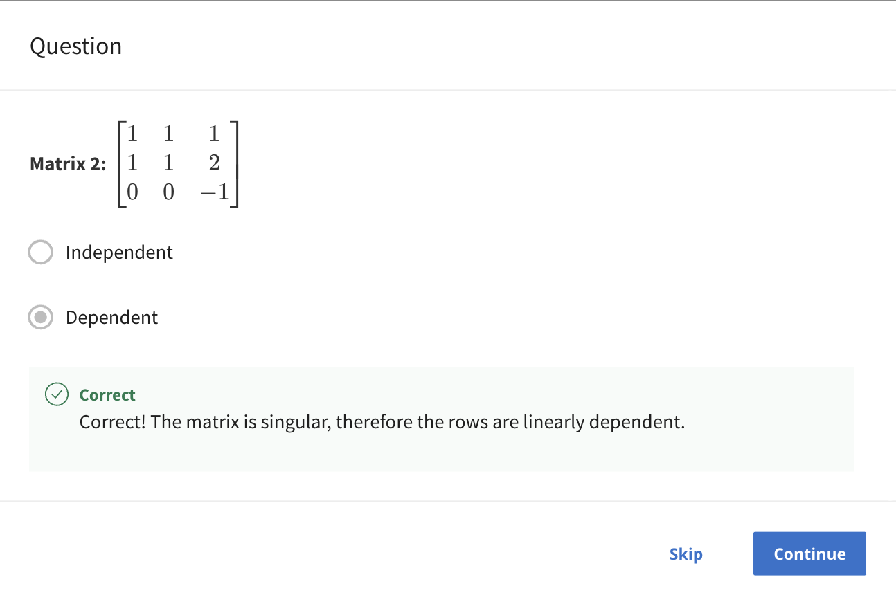

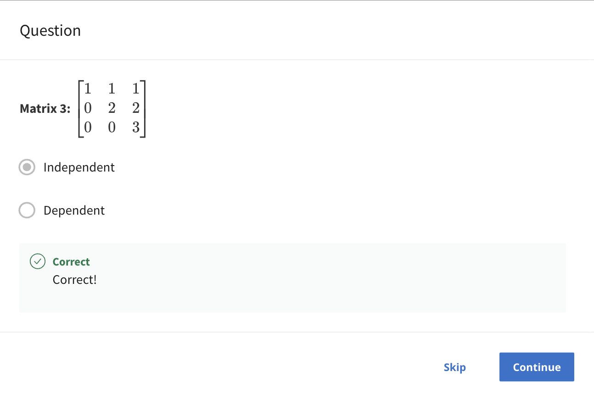
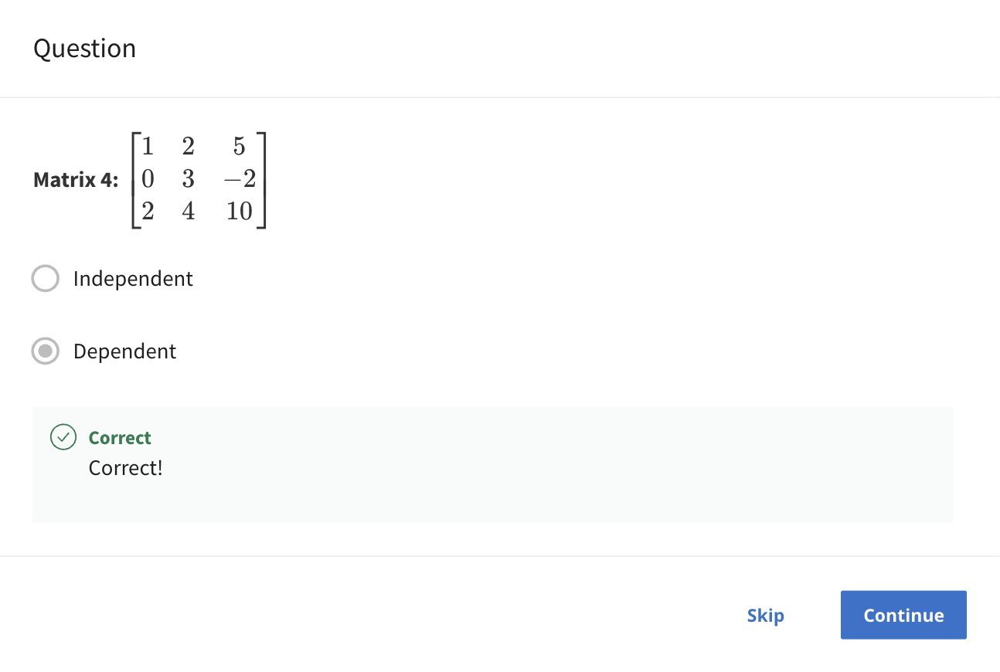

## Final Solution

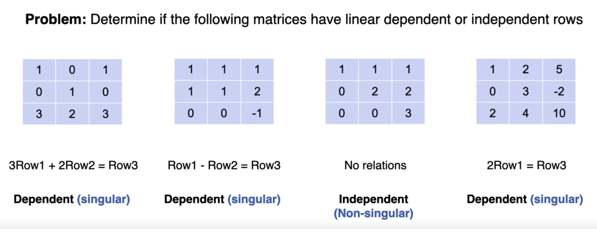
