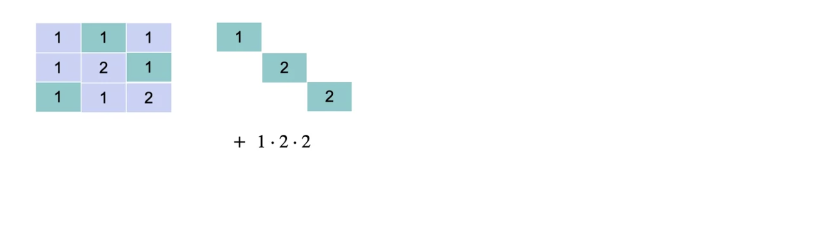
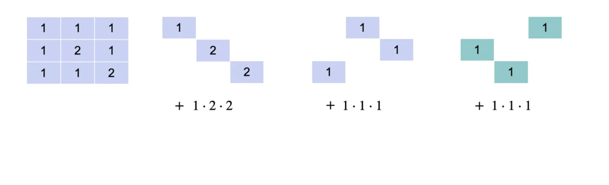
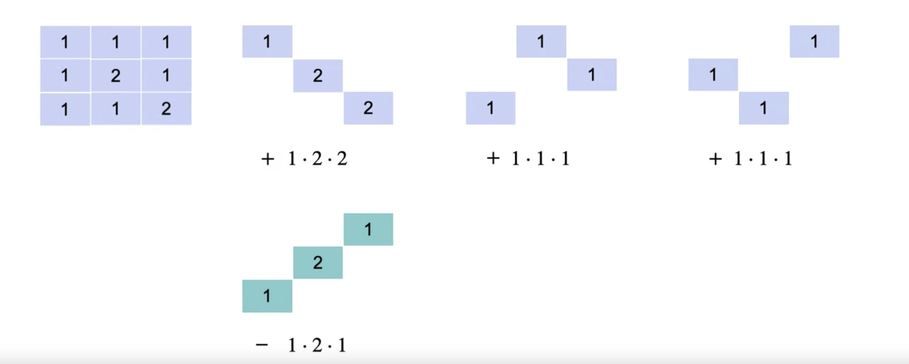

# The determinant (3x3)

From the previous quiz you may be noticing that for many matrices, it is not easy to tell if the rows are linearly dependent or independent, especially as matrices get bigger and bigger. The good news is that just like you saw for two by two matrix, there is a shortcut to tell if a matrix is singular or non singular, namely if the rows are linearly dependent or independent, and that is again the determinant. Recall that for two by two matrix, the determinant is the product of the numbers in the main diagonal minus the product of the numbers in the anti diagonal.

## Diagonals in 3x3 matrix

The determinant for three by three matrix is a bit more complicated than that for two by two matrix, but it is mostly the same. 

Here it is, before calculating the determinant, recall that for a two by two matrix, you consider the main diagonals, add the product of the elements in one of them and subtract the product of the elements in the other one. In a three by three matrix a similar thing happens, except you will need some more diagonals. The first diagonal is the main one over here. 

Now, consider the next diagonal here, let's try to draw it. 

Well, this one is incomplete, so you can complete it by wrapping around the matrix and finishing it like this.

And the same thing happens with the next diagonal. 

We've ran out of space here and wrap around and continue it.

Here's an example, consider this three by three matrix over here. In order to calculate determinant, consider the main diagonal with entries 1, 2 and 2. Its product is going to be the first term in the determinant. Now, move each one box to the right to get the translated diagonal with entries 1, 1 and 1. That product is the second term. Now move one more time and you get this diagonal with entries 1, 1 and 1 and that's the third term. Now to get the subtracting terms, you look at the anti-diagonal, the one that goes in the other direction.

The first one gives us the first term which is the product of 1, 2 and 1. 

For the next one, you move one box and get this one over here, which is 1, 1 and 1. 

And finally this one over here which is 1, 1 and 2. And when you calculate all these products, you get 4 plus 1 plus 1 minus 2 minus 1 minus 2, and that is equal to 1. 

Therefore, this matrix has determinant one. Notice that this means that it's non singular because the determinant is not zero.

## Quiz

Now you're ready for a quiz. Please calculate the determinant of these four matrix, they are the same ones as the previous quiz. So you can verify that the ones that are singular have determined in zero and those non singular have determined different than zero. 

## Answers

### Solution 1

And here are the answers, the first one has determinant zero and so does the second one. So these two are singular. The third one has determined 6, so it's non singular. And the fourth one has determinant 0, so it's singular. Now notice the third matrix, the one that has determinant 6. Let's study it more carefully. Note that this is an upper triangular matrix, meaning that every term underneath the diagonal is 0. And that's very special because for this case the determinant is the product of the diagonal entries. Let me show you why? When you look at the diagonals, you get this one which is product 1 times 2 times 3, you get this one which contains a zero so the product is zero. This one also contains a zero and subtracting terms all contain a zero. Therefore, all these terms are zero because as long as the bottom below the diagonal is formed of zeros, then every terminal determinants is going to contain a zero except for the main diagonal and they're over here. So therefore the product of the elements in the diagonal is equal to the determinant. And that happens in upper triangular matrix, so when you see an upper triangular matrix, it's very easy to calculate the determinant. You simply take the product of the terms in the diagonal. 

### Solution 2

This also happens for bigger matrix and that makes upper triangular matrices very, very popular. Now, check out this other matrix. It's also in writing on form like the previous one, because every element below the diagonal is zero and the determinant is again the product of the elements in the main diagonal, which is this term over here. However, because this term contains zero, then the matrix has determinant zero. And so that shows that if you are in row echelon form, and there are some zero rows, then definitely the matrix is singular and doesn't have full rank.