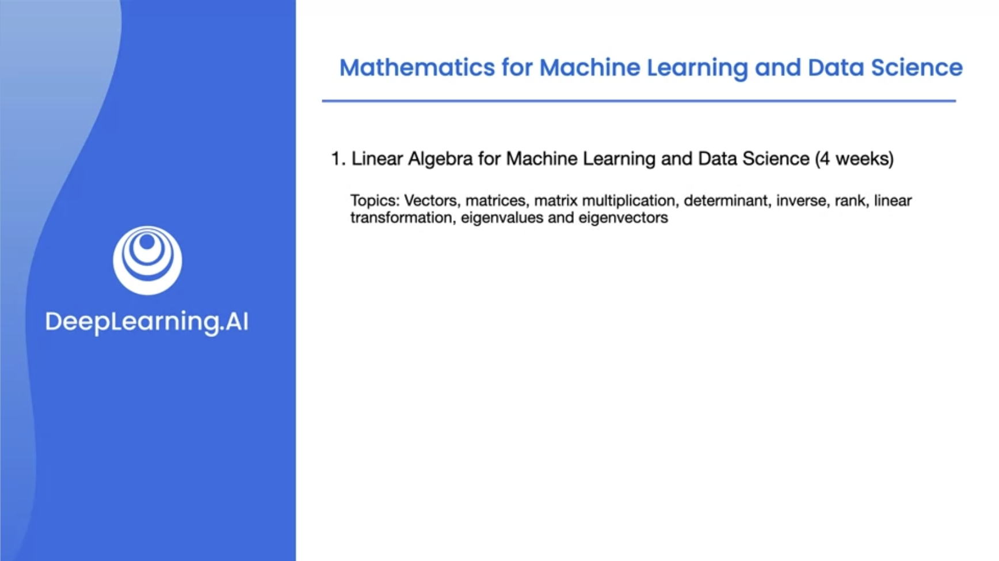
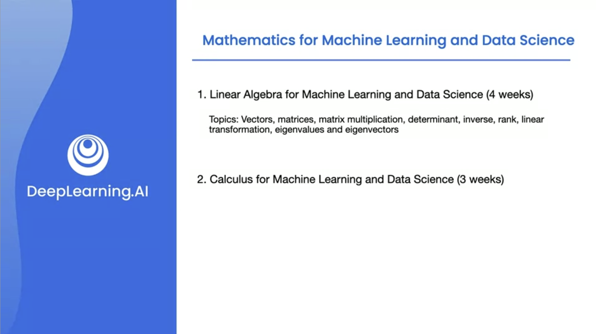
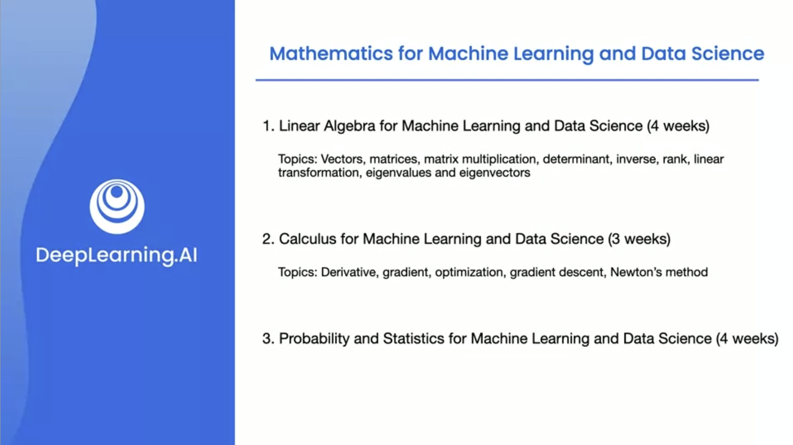
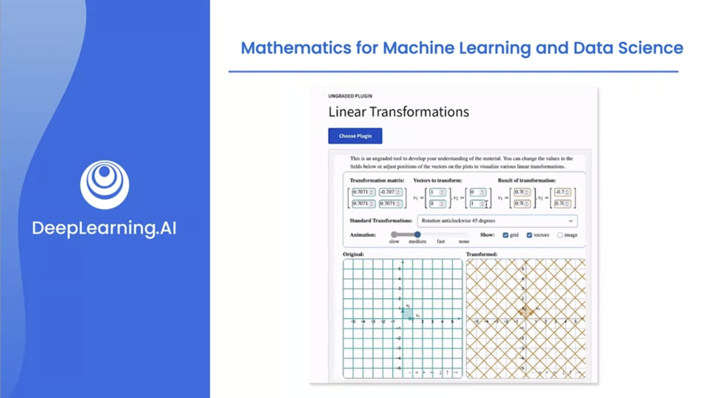
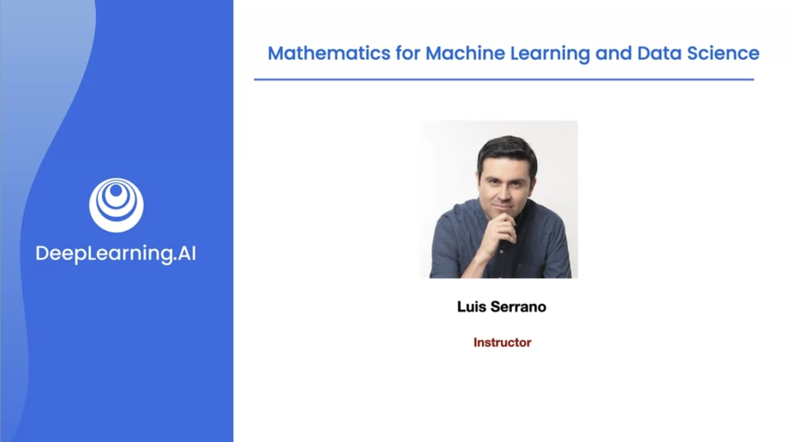

# Speacialization Introduction

## Course 1

Linear Algebra for Machine Learning and DataScience

## Course 2

Calcululus for Machine Learning and DataScience

## Course 3

Probability and Statistics

## Tools

## Faculty

