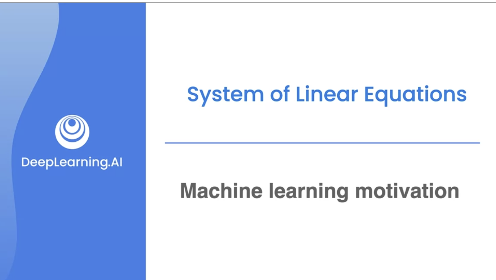
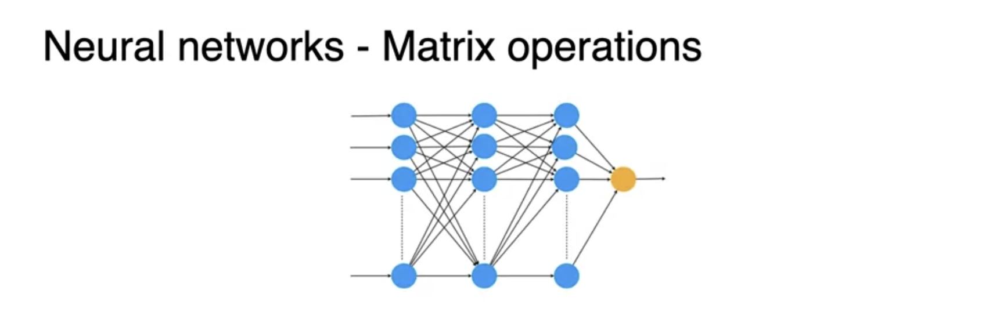
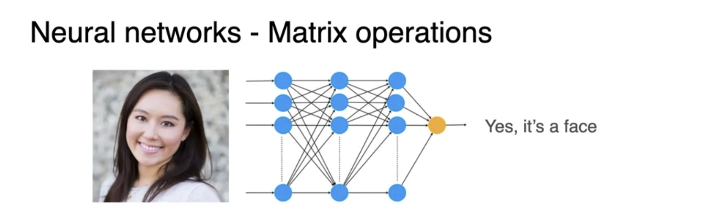
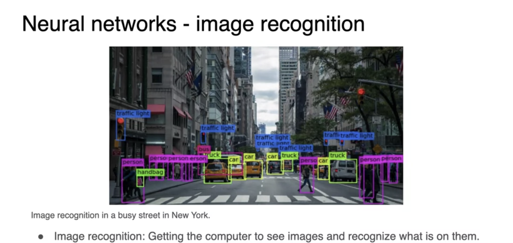

# Machine Learning Motivation

Linear Algebra is the most useful math field in Machine Learning. You will learn some of the popular applications of Linear Algebra in ML.

Most popular is Neural Networks.

Neural networks can be use for applications like image recognition.

How do Neural Networks work?
Its takes an image and apply many mathematical functions to each pixel. 

This results in final value which determines whether this is a face or not.

How does it know which paramters to use? Data helps in picking the parameters.

These blue dots orgnaized in layers are nodes of the neural network. It mimics behavior of neurons.

 These layers can be represented as rectangular arrays of numbers which are also called matrices.

Detecting images and objects has been a long term challenge.

Linear algebra is used all over machine learning. You will learn many important concepts like matrices, linear equations and linear transformations.