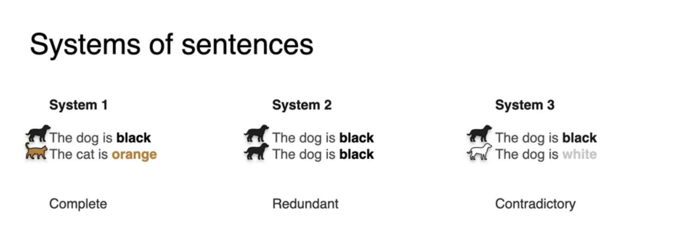
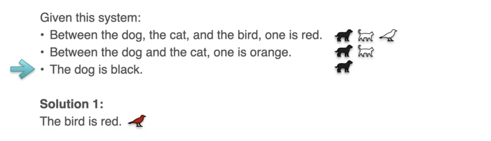

# System of Sentences

## Introduction

Equations combine like Sentences to give information
The first topic you learn in linear algebra is systems of linear equations. However, before you delve into equations, it is important to understand the language of mathematics. When I think of equations, I think of sentences. Sentences that are giving you information about things in the world. And when there are many sentences or systems of sentences as I call them, these sentences combine themselves to give you more information. When looked at from a proper angle, the way sentences combined to give you information is very similar to the way equations combined to give you information. In other words, systems of sentences behave a lot like systems of equations as you'll see in the following example. So let's start with some examples of systems of sentences. Now, for the sake of this example, assume that you only have one dog and one cat and they're both of only one color. You are given some information and your goal is to try to figure out the color of each of the animals. 

So here's system 1 with the sentences, the dog is black and the cat is orange.

Then you have system 2 with sentences, the dog is black and the dog is black. 

And finally you have system 3 with the sentences, the dog is black and the dog is white.

The sentence is yours here are simple sentences with one piece of information each. So sentence such as the dog is black and the dog is white or not allowed and they separately contain two pieces of information. And the goal for a system is to convey as much information as possible with these simple sentences. With regards to achieving that goal notice that these systems are quite different. 

In particular, the first system of sentences contains two sentences and two pieces of information. This means the system contains as many pieces of information as sentences and that's called a **complete system**.

System 2 is a bit less informative as it has two sentences, but they're exactly the same. Therefore the system only carries one piece of information even though it contains two sentences, the sentences he repeat themselves and therefore the system is called **redundant**. 

System three strange as the sentences contradict each other. This is because the dog can't be black and white at the same time remember that we have one dog and it can only have one color. So the system is called the **contradictory system**. 

The more information a system carries, the more useful it will be for you. For this reason will introduce some terminology that you'll be using throughout the whole course. 

## Singular System

When a system is redundant or contradictory, it's called a singular system.

## Non Singular System

When a system is complete, it's called a non singular system. In a nutshell, a non singular system is a system that carries as many pieces of information as sentences. So it's the most informative system can be, and a singular system is less informative than a non-singular one. Systems of sentences can carry more than two sentences. In fact they can carry as many as we want.

## Systems of three sentences

Here are some examples of systems with three sentences. In this new example, you have three animals and are again trying to determine their color.

The first system has the sentences, the dog is black, the carrot is orange and the bird is red. 

The second one has a system says the dog is black, the dog is black and the bird is red. 

The third one says the dog is black, the dog is black and the dog is black. And finally the foreman has the sentences, the dog is black, the dog is white and the bird is red.

So the first system is complete as it carries three different piece of information using three systems, so it's complete and non-singular.

The second system is redundant and singular as the 1st and 2nd sentences, say the exact same thing. Can you guess what the third system is going to be? So if he gets redundant, Well done. The third system is redundant is all the sentences say the same thing. And finally, the fourth system is contradictory because the dog can't be black and white at the same time. Notice that the third system is more redundant than the second system, which has two sentences that say the dog is black. Is there a measure of how redundant a system is? And the answer is yes, and it's called a rank, but you'll learn this a bit later this week. 

And in terms of singularity and non-singularity, the terminologies is exact as before. The first system is non-singular as it is complete and the other three systems are singular as they are either redundant or contradictory. Now system can be a bit more complicated than the ones who previously saw. 

## Question

Consider the system of sentences. Sentence one says between the dog, the cat and the bird, one of them is red. Sentence two says between the dog and the cat, one of them is orange and sentence three says the dog is black. So problem one of the squids says, can you figure out what color is the bird? 

And problem too says, is this system singular or non-singular? 

## Solution Discussion

We have pasted the problem again below.

And the solution for question one is that the bird is red, why? Well, if you look at the third sentence, it says that the dog is black.

So now you know that the dog is black in the entire system of sentences. When you look at the second sentence, it says that between the dog and the cat, one of them is orange, since the dog is black, then the cat must be orange.

And finally the first sentence says that among the three animals, one of them is red, since the dog is black and the cat is orange, then we must conclude that the bird must be red.

For question two, since you figure out the color of the three animals, That means the system carries three pieces of information with three sentences. In other words, it has no redundancies and no contradictions.

It carries as many pieces of information as sentences. Therefore it is a complete system and it is non-singular.

