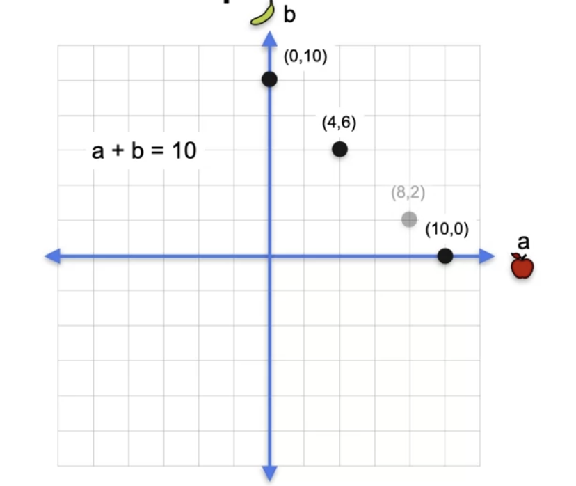
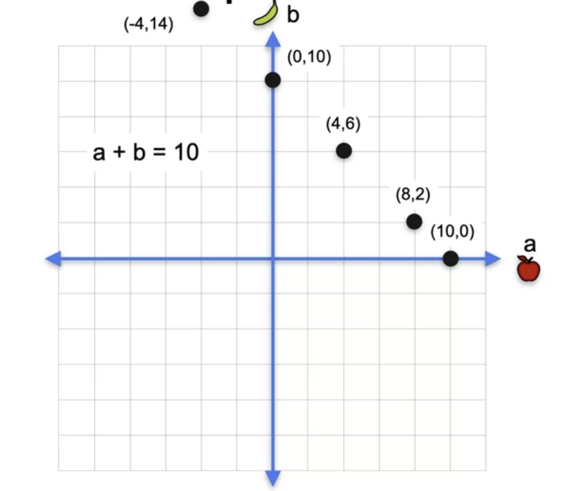
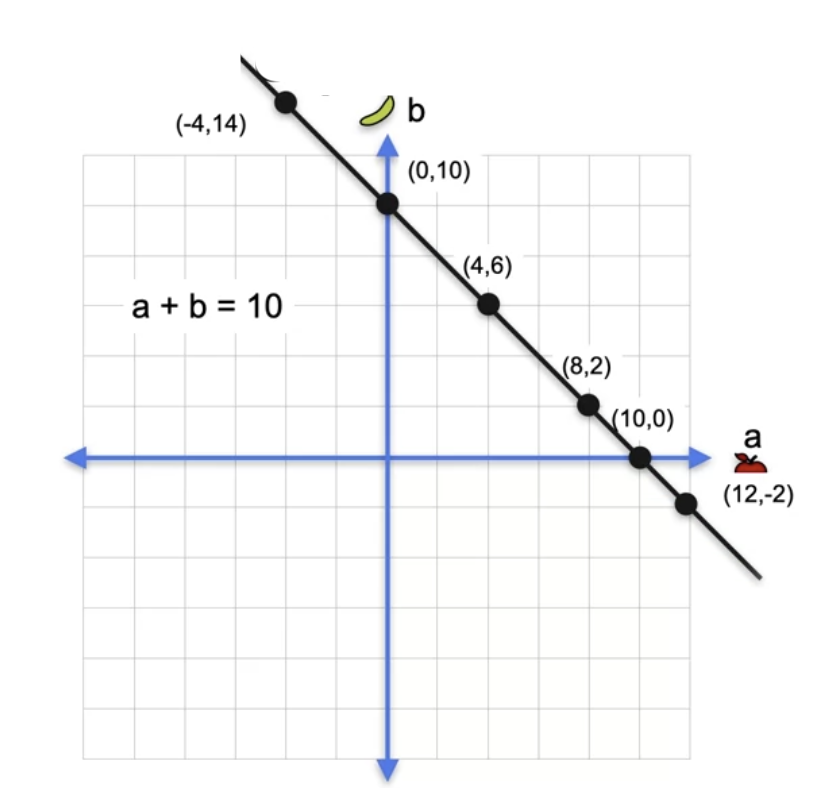
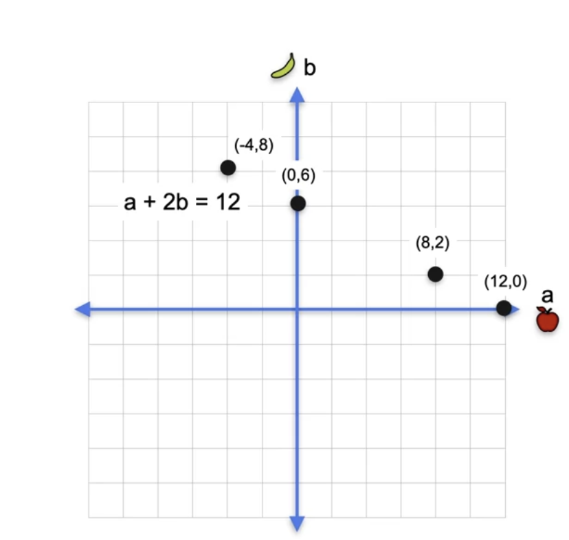
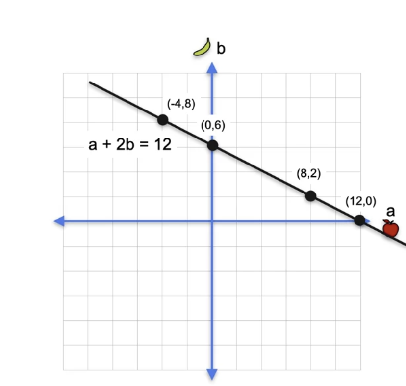
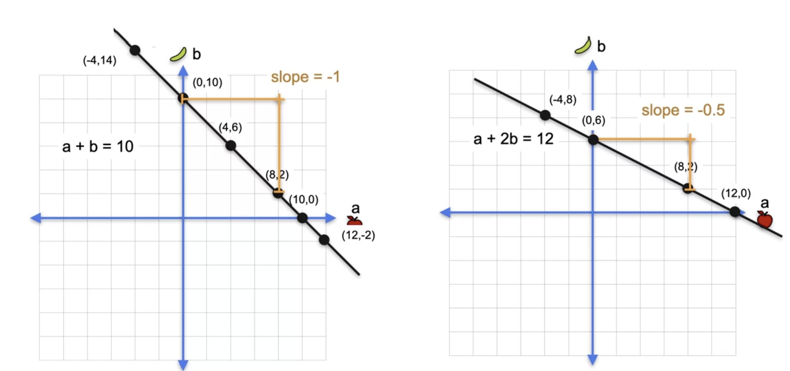
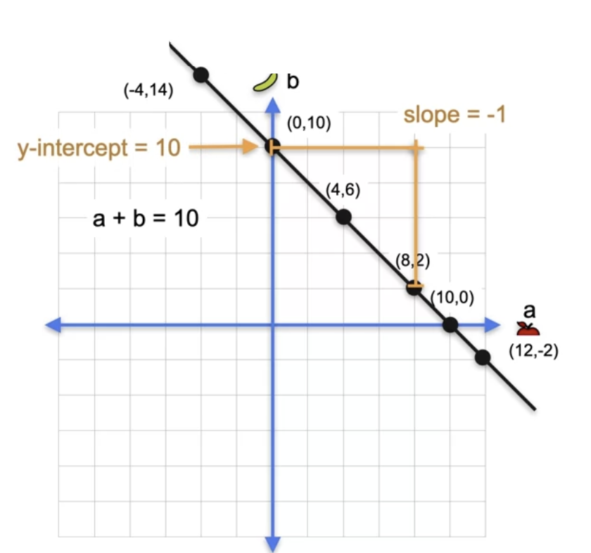
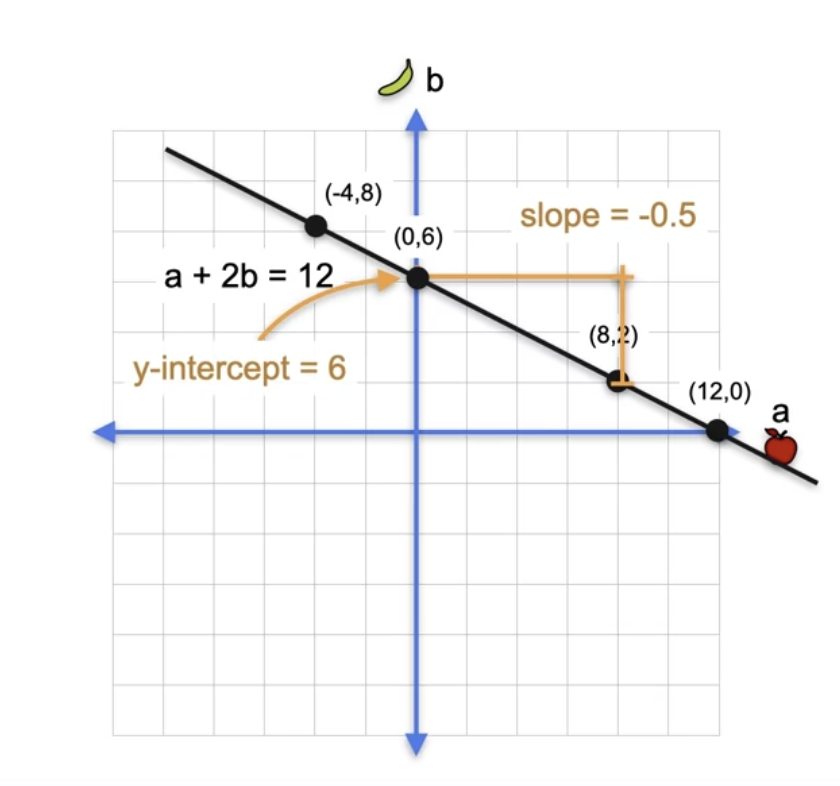

# System of Equations as Lines

## Linear Equations to Lines

Now that you've learned what a system of linear equations is and when they are singular or non-singular, it is time for some visualizations. It turns out that linear equations can easily be visualized as lines in the coordinate plane. This is because you have two variables. If you have three variables, they are planes in space. If you have more variables, they look like high-dimensional space. But let's not worry about that yet. Since linear equations can be represented as lines, then systems of linear equations can be represented as arrangements of lines in the plane. This way, you can visualize their solutions and their singularity or non-singularity in a much clear way. How can you visualize, for example, the equation a plus b equals 10 as a line? First, let us get a grid in which the horizontal axis represents a, which is the price of an apple, and the vertical axis represents b, which is the price of a banana. Now let's look at solutions to this equation 

    a + b = 10

In other words, pairs of numbers that add to 10. What you'll do is put them in this plot. Two obvious solutions are the point 10, 0. The a coordinate, the price of an apple, is 10 and the b coordinate, the price of a banana, is zero because 10 plus 0 is 10. Another obvious solution is the point 0, 10 where a is zero and b equals 10.

Other solutions are the point 4, 6 because 4 plus 6 equals 10. This is a equals 4 and b equals 6 or the point 8, 2 where a equals and b equals 2. Notice that you can also have negative solutions, for example minus 4,14. Now, this makes no sense in the world problem because an apple cannot cost minus 4. But these are two numbers that add to 10, minus 4 plus 14 equals 10. This is a legitimate solution to the equation. You can also have negative solutions like 12, minus 2.

Now notice that all these points form a line. 

In fact, every single point in this line is solution to the equation. You can then associate the equation a plus b equals 10 with this line. Now let's do another equation. Say the equation 

    a + 2b = 12

That means points for which the horizontal coordinate plus two times the vertical coordinate add to 12. Some solutions for this equation are the point 0,6 since 0 plus 2 times 6 equals 12.

The point 12,0 because 12 plus 2 times 0 is 12. The point 8,2 because 8 plus 2 times 2 is 12. Again, negative solutions like minus 4,8 for example, because minus 4 plus 2 times 8 is 12. Again, these points form a line and every point in the line is a solution to this equation. The line is associated with the equation a plus 2b equals 12. One small assignment, be familiarized with the notions of slope and y-intercept in a line. The slope is the ratio of rise over run which in the line on the left is minus 1. As for every unit you move to the right, the line moves one unit down.

The down is the minus the negative. For the line on the right, the slope is minus a half because for every unit you move to the right, the line moves half a unit down. 

For the y-intercept for a line on the left, it is 10 as this is the height of the intersection between the line and the vertical y-axis, and for the line on the right it is six.

