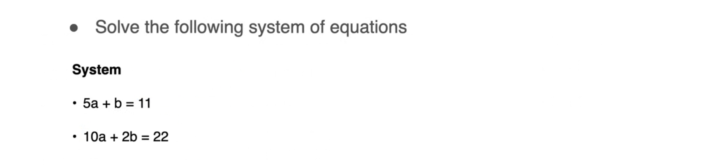

# Solving Singular Systems

Now this method is actually more powerful than you think. In the previous examples, you saw it in action for a non-singular system that has a unique solution. But what happens with a singular system namely one that does not have a unique solution. Let us solve the singular system that also came up before the system of equations $a + b = 10$ and $2a + 2b = 20$.

Recall that the system was redundant since the second equation is equivalent to the first one. So let's try the same steps as before to try to eliminate a from the second equation and see where that takes us. 

1. The first step is to divide both equations by the coefficient of a getting the two equations $a + b = 10$ and $a + b =10$. Notice that they're the same. 

    

2. The next step is to remove a from the second equation by subtracting the equation $a + b = 10$ from the equation $a + b = 10$. Now what do you get here? Well, you get 0 = 0 because you're subtracting the entire string from itself.

    

This equation $0 = 0$ is trivially true and unfortunately gives you zero information about what b can be. What happened? Well, in your efforts of removing a from the second equation or to leave b alone, you also remove b. And there is nothing you can do to get b. There's no manipulation you can do to remove only one of the variables because anything you do to remove one will also remove the other one because the system is singular. And again, this is because the second equation adds no value to the system. So in other words, the solved system is this one where $a + b = 10$ and there's no other equation to give us more information. 

So can you still get the solution to look like a equals something and b equals something else? Well you still can pick any number x and let a equals be x. How much is b then? Well if $a + b = 10$, then $b$ must be $10- x$. This is a solution to the system. 

It's not a unique solution because x can be any value. So the solve system has one degree of freedom and if you vary this degree of freedom x, you can get many different solutions to the system.

The solutions for example form a line as you said before. 

### Contradictory Singular System

Now, what happens if you use the same method with a singular system that is contradictory? Recall that the contradictory system that you saw earlier was this one $a + b = 10$ and $2a + 2b = 24$. 

And let's use the same steps to solve it. First we want to eliminate a from this equation. So we divide both equations by the coefficient of a. We subtract equation 1 from equation 2 and we get that 0 n the left is equal to 2 on the right. 0 is never equal to 2 so that's a contradiction. 

Therefore there are no solutions to the system.

## Quiz

So now you're ready for a quiz. The quiz is the following. Can you solve the following system of equations $5a + b = 11$ and $10a + 2b = 22$. 

So if you look closely into the two equations in the system, you will find that equation 2is equation 1 times two. Or equivalent if you take equation 2 and divide it by 2, you obtain equation 1. Therefore the system is singular and it has infinitely many solutions.

